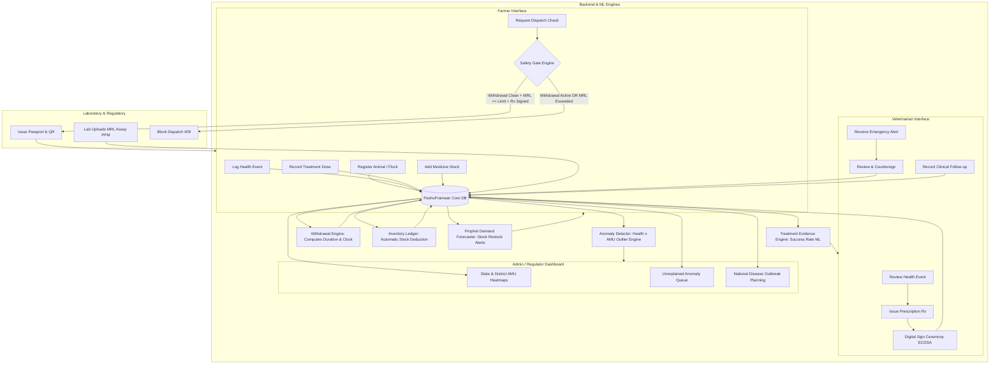

# PashuPramaan — Data Architecture, Inconsistencies & End-to-End Data Flow

This document provides a comprehensive audit of all frontend data requirements across the **Farmer**, **Veterinarian**, **Admin / Regulator**, and **Laboratory / System** roles.

---

## 1. Inconsistencies & Unresolved References

During a complete audit of the frontend pages, modals, and dummy APIs, several cross-role data gaps, unlinked producers/consumers, and unresolved references were identified:

### 1.1. Laboratory Assay & MRL Test Results (Producer Missing)
* **What is expected in UI**:
  * Farmer Dispatch Gate (`StartDispatchModal.tsx`) enforces a hard safety gate on MRL: `Lab Result: 0.04 ppm / Permitted: 0.10 ppm` and status `WITHIN LIMIT` vs `EXCEEDED`.
  * Farmer Treatments Table (`treatments.ts`) displays a `Lab ≤ MRL` badge.
* **The Inconsistency**:
  * There is **no laboratory role, lab test ingestion form, or lab API** in the frontend. Neither the farmer nor the vet can enter official laboratory residue assay results. The dispatch screen expects lab data to exist, but no actor currently provides it.

---

### 1.2. Cross-Role Entity Mismatches (Farm Names, Animals, and Species)
* **Farm Discrepancy**:
  * The **Farmer dashboard** is hardcoded to a single farm: `Shree Krishna Dairy`.
  * The **Vet dashboard** shows Dr. Bankey managing cases across `Shanti Dairy`, `Krishna Dairy`, and `Meena Poultry`.
* **Animal & ID Discrepancies**:
  * In `farm-detail.ts`, `MP-104` is registered as a **Cow** belonging to `Shree Krishna Dairy`.
  * In `animal-detail.ts`, `MP-104` is listed as a **Buffalo (Gir breed)**.
  * In `vet-dashboard.ts`, `MP-104` is listed under `Shanti Dairy`.
  * In `vet-patients.ts`, `MP-118` is listed as a **Cow**, whereas in `vet-case-detail.ts` `MP-118` is listed as a **Buffalo · Dairy**.

---

### 1.3. Emergency Dose Logging vs. Vet Countersignature Context
* **Farmer Action**:
  * In `RecordTreatmentModal.tsx`, a farmer logs an emergency dose under `"No signed Rx — Emergency Log"`. The farmer selects animal ID and timing, but does **not** specify clinical diagnosis, symptoms, or which vet to notify.
* **Vet Action**:
  * In `CountersignStep.tsx` & `vet-dashboard.ts`, the vet receives an alert for `Flock P-01` with an already-populated diagnosis (`Gumboro (IBD)`) and clinical reason (`Outbreak control / secondary infection`).
* **The Inconsistency**:
  * There is no field where the farmer reports the clinical emergency condition to the vet, yet the vet's countersignature screen expects structured clinical condition data.

---

### 1.4. Inventory Units vs. Prescribed Dosages
* **Farmer Inventory**:
  * In `AddMedicineStockModal.tsx`, inventory is stored in packaged units: `vials`, `doses`, `mL`, `tablets`.
* **Vet Prescription & Administration**:
  * In `NewPrescriptionModal.tsx`, the vet prescribes in clinical concentrations (e.g. `10 mg/kg`, `20 mg/kg in drinking water`, `500 mcg/kg pour-on`).
* **The Inconsistency**:
  * Without animal weight tracking (biomass) and drug concentration per mL/vial in a master drug formulary, the system cannot automatically deduct inventory or convert treatment doses into package reductions.

---

### 1.5. Disease Taxonomy & Health Event Linkage
* **Farmer Health Event Modal** (`RecordHealthEventModal.tsx`):
  * Captures coarse categories: `Illness`, `Injury`, `Abnormal Behaviour`, `Other`, with a freeform text `description`.
* **Vet Case Review & Admin Surveillance** (`vet-case-detail.ts`, `page.tsx (admin)`):
  * Expects formal disease codes/names (e.g., `Clinical mastitis`, `Gumboro (IBD)`, `Colibacillosis`, `Foot rot`, `Newcastle disease`, `Pneumonia`) to link health events to prescriptions and correlate with AMU spikes in the anomaly detection engine.

---

### 1.6. Dynamic Withdrawal Period Calculation
* **Farmer UI**:
  * Shows withdrawal badges and messages: *"Milk clears tomorrow, 10:30 AM"* or *"Eggs clear in 4 days"*.
* **Missing Master Rules**:
  * Withdrawal periods vary by **species** (cattle vs goat vs poultry), **product type** (milk vs meat vs eggs), **drug formulation**, and **dose/route**. Currently, these are static mock strings rather than calculated by a central rules engine based on treatment time + withdrawal hours.

---

### 1.7. Cryptographic Signature & Vet Authorization
* **UI**:
  * Vet signs via PIN (`1234`) and canvas signature.
* **Contract**:
  * The API contract specifies ECDSA P-256 digital signing with tamper-proof signature hashes. The frontend currently generates random hex strings (`Signed · 8F4A12B3`).

---

## 2. Complete List of Required Data Entities

### 2.1. Master / Reference Data
1. **User & Identity**: User ID, Full Name, Role (`farmer`, `vet`, `admin`, `lab_technician`), Phone/Email, State/District, License/Registration No. (VCI registration for Vets), PIN Hash.
2. **Farms & Premises**: Farm ID, Farm Name, Owner ID, Zone, State, District, Village/Pincode, GPS Coordinates, Farm Category (`Dairy`, `Poultry`, `Goatry`, `Mixed`).
3. **Medicine & Drug Formulary Master**:
   * Drug ID, Brand Name, Generic Active Ingredient, Formulation (`Injectable`, `Oral Liquid`, `Feed Premix`, `Pour-on`, `Intramammary`).
   * Concentration (e.g. `100 mg/mL`).
   * Stewardship Classifications: WHO AWaRe (`ACCESS`, `WATCH`, `RESERVE`), CIA Status (`true`/`false`).
   * Standard Withdrawal Periods (Matrix by species & product: Milk days, Meat days, Egg days).
   * Default MRL Limit (ppm) for milk, meat, and eggs.
4. **Disease & Clinical Diagnosis Taxonomy**: Disease Code, Standardized Diagnosis Name, Target Species, Symptoms / Clinical Signs, Severity Tier.
5. **Geographic Boundaries**: State Slugs, District Names, GeoJSON Polygons, Census Codes.

---

### 2.2. Operational & Transactional Data
1. **Animals & Flocks**: Animal/Flock Tag ID (RFID/Ear Tag), Farm ID, Species (`Cow`, `Buffalo`, `Goat`, `Sheep`, `Pig`, `Poultry`), Breed, Sex, Date of Birth, Production Type (`Dairy`, `Meat`, `Dual`, `Broiler`, `Layer`), Health Status (`healthy`, `under_treatment`, `waiting`).
2. **Health Events**: Event ID, Farm ID, Animal/Flock ID, Reporter ID (Farmer), Date Observed, Event Category, Reported Disease/Symptoms, Detailed Notes, Status (`reported`, `vet_reviewed`, `resolved`).
3. **Veterinary Prescriptions (Rx)**: Rx ID, Vet ID, Farm ID, Animal/Flock ID, Linked Health Event ID, Clinical Diagnosis, Drug ID, Dose Amount, Dose Unit, Route, Frequency, Duration Days, Clinical Reason, AWaRe/CIA Classification, Status (`SIGN-REQ`, `SIGNED`, `VOIDED`, `COUNTERSIGNED`), Digital Signature Hash, Signed Timestamp.
4. **Treatment Administrations & Doses**: Treatment ID, Rx ID (or `null` if Emergency Exception), Farm ID, Animal/Flock ID, Drug ID, Route & Dosage Given, Administered Timestamp, Is Backdated (`true`/`false`), Actual Dose Timestamp, Administered By User ID, Is Emergency Exception (`true`/`false`), Emergency Reason.
5. **Withdrawal Clocks**: Withdrawal ID, Treatment ID, Animal/Flock ID, Product Affected (`Milk`, `Meat`, `Eggs`), Clock Start Time, Withdrawal Duration Hours, Expected Clear Timestamp, Status (`ACTIVE`, `CLEARED`, `EARLY_TERMINATION`).
6. **Medicine Inventory & Stock Ledger**: Stock Item ID, Farm ID, Drug ID, Batch Number, Quantity Received, Quantity Unit (`vials`, `mL`, `doses`, `tablets`), Expiry Date, Supplier, Date Received, Current Balance, Minimum Threshold Alert Level.
7. **Laboratory Assay Results**: Assay ID, Farm ID, Animal/Flock ID, Dispatch ID (optional), Product Sampled, Sampling Date, Testing Lab Name & Accreditation No., Target Drug/Residue, Detected Residue PPM, Permitted MRL PPM, Assay Outcome (`WITHIN_LIMIT`, `EXCEEDED`), Certified By (Lab Tech ID), Timestamp.
8. **Dispatches & PashuPramaan Passports**: Dispatch ID, Passport ID, Farm ID, Animal/Flock IDs (array), Product Type (`Milk`, `Meat`, `Eggs`), Quantity & Unit (e.g. `500 L`), Dispatch Date, Destination / Buyer Name, Hard Gate Audit:
   * Withdrawal Gate: `CLEARED` | `ACTIVE`
   * MRL Gate: `WITHIN_LIMIT` | `EXCEEDED` | `WAIVED_NO_ASSAY`
   * Prescription Gate: `VET_SIGNED` | `EMERGENCY_COUNTERSIGNED` | `UNSIGNED`
   * Status: `CLEARED` | `BLOCKED` | `COMPLETED`
   * Passport QR Payload & Cryptographic Seal.
9. **Vet Countersignatures**: Countersignature ID, Emergency Treatment ID, Vet ID, Review Timestamp, Clinical Confirmation Notes, Digital Signature Hash, Reference ID.
10. **Clinical Follow-ups & Outcomes**: Follow-up ID, Patient Animal ID, Vet ID, Evaluation Date, Outcome (`Recovered`, `Improved`, `No Change`, `Worsened`, `Relapse`), Clinical Notes, Treatment Status (`COMPLETED`, `EXTENDED`, `MODIFIED`).

---

### 2.3. Analytics & Regulatory Data
1. **Farm AMU & Performance Metrics**: Monthly total AMU index, species-wise treatment counts, cost of medication, milk/egg output correlation.
2. **District & State AMU Aggregates**: State Slug, District Name, Year, Species, Category (`individual` vs `flock`), Total Livestock Headcount, Active Anomaly Spikes, AMU Index Volume, % Change vs Prior Period, Unexplained Outlier Count.
3. **ML Anomaly Detection Records**: Anomaly ID, Farm ID, State, District, Drug ID, AMU % Increase, Baseline Norm, Correlated Health Event ID (`null` if unexplained), Severity (`HIGH`, `MEDIUM`, `LOW`), Status (`EXPLAINED`, `UNEXPLAINED`), Model Confidence Score.
4. **Predictive Demand & Outbreak Forecasts**: Region/Farm ID, Drug ID, Forecast Month, Historical Usage, Predicted Requirement, Demand Level (`LOW`, `MEDIUM`, `HIGH`), Restock Recommendation.

---

## 3. Data Schemas (TypeScript & JSON Definitions)

```typescript
// ==========================================
// 1. MASTER & USER SCHEMAS
// ==========================================

export interface User {
  id: string; // UUID
  role: "farmer" | "vet" | "admin" | "lab_technician";
  name: string;
  phone: string;
  email?: string;
  farm_id?: string; // For farmers
  vet_license_number?: string; // For vets (VCI)
  pin_hash?: string; // Hashed PIN for signing
  state: string;
  district: string;
  created_at: string; // ISO 8601
}

export interface Farm {
  id: string; // UUID
  name: string;
  owner_id: string; // User UUID
  category: "Dairy" | "Poultry" | "Goatry" | "Mixed";
  state: string;
  district: string;
  village_pincode: string;
  latitude?: number;
  longitude?: number;
  status: "GOOD" | "ATTENTION" | "CRITICAL";
  created_at: string;
}

export interface DrugMaster {
  id: string; // e.g. "DRUG-OXY-01"
  brand_name: string; // "Oxytetracycline 10%"
  generic_name: string; // "Oxytetracycline"
  formulation: "Injectable" | "Oral" | "Feed Premix" | "Pour-on" | "Intramammary";
  concentration_mg_per_ml: number;
  aware_class: "ACCESS" | "WATCH" | "RESERVE";
  is_cia: boolean;
  withdrawal_rules: {
    species: "Cow" | "Buffalo" | "Goat" | "Sheep" | "Pig" | "Poultry";
    product: "Milk" | "Meat" | "Eggs";
    withdrawal_hours: number;
    mrl_limit_ppm: number;
  }[];
}

// ==========================================
// 2. LIVESTOCK & HEALTH SCHEMAS
// ==========================================

export interface Animal {
  id: string; // Ear Tag or Flock ID, e.g. "MP-104" or "Flock P-01"
  farm_id: string;
  type: "Cow" | "Buffalo" | "Goat" | "Sheep" | "Pig" | "Poultry";
  breed?: string;
  sex: "Male" | "Female";
  date_of_birth?: string;
  production_type: "Dairy" | "Meat" | "Dual" | "Broiler" | "Layer";
  status: "healthy" | "under_treatment" | "waiting";
  registered_on: string;
}

export interface HealthEvent {
  id: string;
  farm_id: string;
  animal_id: string;
  reported_by: string; // Farmer User ID
  date_observed: string;
  category: "Illness" | "Injury" | "Abnormal Behaviour" | "Outbreak" | "Other";
  disease_code?: string; // Standard taxonomy link
  description: string;
  status: "reported" | "vet_reviewed" | "resolved";
  created_at: string;
}

// ==========================================
// 3. PRESCRIPTIONS & TREATMENTS
// ==========================================

export interface Prescription {
  rx_id: string; // "Rx-208"
  vet_id: string;
  vet_name: string;
  farm_id: string;
  farm_name: string;
  animal_id: string;
  linked_health_event_id?: string;
  diagnosis: string;
  drug_id: string;
  drug_name: string;
  dose_amount: number;
  dose_unit: string; // "mg/kg", "mL"
  route: "Oral" | "Intramuscular" | "Subcutaneous" | "Intravenous" | "Intramammary" | "Drinking water";
  frequency: "Once daily" | "Twice daily" | "Three times daily" | "Continuous in feed";
  duration_days: number;
  reason?: string;
  aware_class: "ACCESS" | "WATCH" | "RESERVE";
  is_cia: boolean;
  status: "SIGN-REQ" | "SIGNED" | "VOIDED" | "COUNTERSIGNED";
  digital_signature?: {
    signed_by: string;
    signature_ref: string;
    signature_hash: string;
    signed_at: string;
  };
  created_at: string;
}

export interface TreatmentAdministration {
  id: string; // "trt-1"
  farm_id: string;
  animal_id: string;
  rx_id: string | null; // Null if emergency exception
  drug_id: string;
  drug_name: string;
  dose_given: string;
  route: string;
  administered_at: string;
  is_backdated: boolean;
  actual_administered_time: string;
  administered_by_id: string;
  is_emergency_exception: boolean;
  emergency_notes?: string;
  status: "Active" | "Withdrawal" | "Completed" | "Unsigned";
  created_at: string;
}

export interface WithdrawalClock {
  id: string;
  treatment_id: string;
  farm_id: string;
  animal_id: string;
  product: "Milk" | "Meat" | "Eggs";
  start_time: string;
  duration_hours: number;
  clears_at: string;
  status: "ACTIVE" | "CLEARED";
  progress_pct: number;
}

// ==========================================
// 4. INVENTORY & LAB ASSAYS
// ==========================================

export interface MedicineInventoryItem {
  id: string;
  farm_id: string;
  drug_id: string;
  drug_name: string;
  batch_number: string;
  quantity_received: number;
  quantity_remaining: number;
  unit: "vials" | "doses" | "mL" | "tablets";
  date_received: string;
  expiry_date: string;
  restock_status: "sufficient" | "monitor" | "restock_recommended";
}

export interface LabAssay {
  assay_id: string;
  farm_id: string;
  animal_id: string;
  product: "Milk" | "Meat" | "Eggs";
  sample_date: string;
  testing_lab: string;
  tested_drug: string;
  lab_result_ppm: number;
  permitted_ppm: number;
  status: "within_limit" | "exceeded";
  tested_by_tech_id: string;
  created_at: string;
}

// ==========================================
// 5. DISPATCH & PASSPORT
// ==========================================

export interface DispatchPassport {
  id: string; // "DSP-024"
  passport_id: string; // "PP-2026-104"
  farm_id: string;
  farm_name: string;
  animal_ids: string[];
  product: "Milk" | "Meat" | "Eggs";
  quantity?: string;
  dispatch_date: string;
  gates_audit: {
    withdrawal_cleared: boolean;
    withdrawal_detail: string;
    mrl_cleared: boolean;
    mrl_ppm?: number;
    mrl_permitted_ppm?: number;
    prescription_signed: boolean;
    has_lab_assay: boolean;
  };
  status: "cleared" | "withdrawal" | "blocked";
  qr_verification_url: string;
  digital_seal: string;
  created_at: string;
}

// ==========================================
// 6. CLINICAL OUTCOMES & REGULATORY
// ==========================================

export interface ClinicalFollowUp {
  id: string;
  patient_id: string; // Animal ID
  vet_id: string;
  farm_id: string;
  follow_up_date: string;
  outcome: "Recovered" | "Improved" | "No Change" | "Worsened" | "Relapse";
  notes: string;
  created_at: string;
}

export interface AnomalyRecord {
  id: string; // "A001"
  farm_id: string;
  farm_name: string;
  state: string;
  district: string;
  drug_name: string;
  amu_change_pct: number;
  baseline_level: number;
  linked_health_event: string | null;
  status: "EXPLAINED" | "UNEXPLAINED";
  severity: "HIGH" | "MEDIUM" | "LOW";
  species: string;
  detection_date: string;
  history_12m: number[];
}
```

---

## 4. End-to-End Data Flow

The following diagram illustrates how data flows between the Farmer, Veterinarian, System Engines, Laboratory, and Admin/Regulator:



---

### Detailed Lifecycle Steps

1. **Animal Registration**:
   * *Producer*: Farmer (`AddAnimalModal`).
   * *Data*: Animal/Flock tag, species, breed, sex, production type.
   * *Consumers*: Farm Overview, Vet Patient List, Dispatch Animal Picker.
2. **Health Event Reporting**:
   * *Producer*: Farmer (`RecordHealthEventModal`).
   * *Data*: Animal ID, observation date, symptom/category, description.
   * *Consumers*: Vet Workload Alert / Case Detail, Admin Outbreak Correlator.
3. **Veterinary Prescription & Digital Signing**:
   * *Producer*: Vet (`NewPrescriptionModal`, `SignStep`).
   * *Data*: Diagnosis, drug, dosage, route, frequency, duration, AWaRe/CIA classification, ECDSA digital signature.
   * *Consumers*: Farmer Treatment Picker, Stewardship Compliance Monitor.
4. **Treatment Administration & Inventory Ledger**:
   * *Producer*: Farmer (`RecordTreatmentModal`).
   * *Data*: Animal, Rx reference, dose time (live or $\le 72\text{h}$ backdated).
   * *System Trigger*: Automatically deducts volume from `medicine_inventory` and initializes `withdrawal_clocks`.
   * *Consumers*: Farmer Withdrawal Ribbon, Animal Status (`under_treatment`).
5. **Emergency Treatment & Countersignature Loop**:
   * *Producer*: Farmer (`RecordTreatmentModal` $\rightarrow$ Emergency Exception).
   * *System Trigger*: Immediately starts emergency withdrawal clock; flags high-priority `unsigned_emergency` in Vet Workload.
   * *Vet Action*: Vet reviews and countersigns (`CountersignStep`) $\rightarrow$ Marks treatment `COUNTERSIGNED`.
6. **Laboratory Residue Assay**:
   * *Producer*: Accredited Laboratory.
   * *Data*: Farm, animal sample, target compound, residue PPM, assay pass/fail.
   * *Consumers*: Dispatch Gate Engine, National Food Safety Audit Log.
7. **Dispatch Gate & PashuPramaan Passport**:
   * *Producer*: Farmer (`StartDispatchModal`).
   * *Safety Gate Audit*: Checks Withdrawal Clock == `CLEARED` AND MRL $\le$ Permitted Limit AND Rx == `SIGNED` or `COUNTERSIGNED`.
   * *Outcome*:
     * *Pass*: Emits verifiable Passport `PP-YYYY-XXX` with QR code and cryptographic seal.
     * *Fail*: Fails closed with `409 Blocked` (displays active withdrawal countdown / exceeded PPM).
8. **Clinical Follow-up & Treatment Evidence**:
   * *Producer*: Vet (`RecordFollowUpModal`).
   * *Data*: Animal ID, outcome (`Recovered`, `Improved`, `Relapse`), clinical notes.
   * *Consumers*: Treatment Evidence Engine ($n \ge 10$ success rates on vet dashboard), marks animal `healthy`.
9. **National AMU Surveillance & Anomaly Detection**:
   * *Aggregator*: System background jobs.
   * *Engine*: Calculates monthly district AMU; cross-references AMU surges with documented health events.
   * *Consumers*: Admin Heatmaps, Unexplained Anomaly Investigation Queue, State Policy Forecasting.
