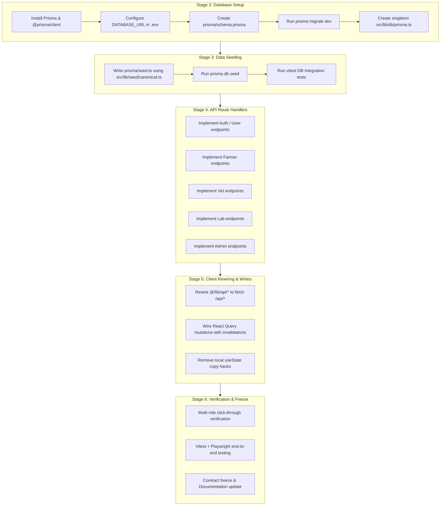

# PashuPramaan — PostgreSQL Database Migration & API Implementation Plan

**Canonical copy:** this file (`docs/plan.md`).  
**Status:** Stage 1 Completed (Canonical seed & conflict audit verified). PostgreSQL database setup, relational schema, Next.js API routes, and full persistence ready for implementation.

---

## 1. Executive Summary & Architecture

### Goal
Transition PashuPramaan from the in-memory canonical dummy store (`src/lib/seed/`) to a production-ready **PostgreSQL relational database** with **Prisma ORM**, full relational models across all four roles (**Farmer**, **Veterinarian**, **Lab Technician**, **Administrator/Regulator**), Next.js App Router API Route Handlers (`src/app/api/...`), and live TanStack Query client integration.

```
┌──────────────────────────────────────────────────────────────────────────────────┐
│                             FRONTEND UI (App Router)                             │
│      Farmer (/farmer/*)  │  Vet (/vet/*)  │  Lab (/lab/*)  │  Admin (/admin/*)   │
└────────────────────────────────────────┬─────────────────────────────────────────┘
                                         │ TanStack Query (Hooks & Invalidation)
                                         ▼
┌──────────────────────────────────────────────────────────────────────────────────┐
│                           API CLIENT LAYER (@/lib/api/*)                         │
│             Replaces dummy in-memory adapters with real fetch() to /api/*        │
│                    (Preserves exact DTO signatures & contracts)                  │
└────────────────────────────────────────┬─────────────────────────────────────────┘
                                         │ JSON over HTTP REST
                                         ▼
┌──────────────────────────────────────────────────────────────────────────────────┐
│                   NEXT.JS APP ROUTER API ROUTES (src/app/api/*)                  │
│   /api/auth/*   /api/farmer/*   /api/vet/*   /api/lab/*   /api/admin/*           │
└────────────────────────────────────────┬─────────────────────────────────────────┘
                                         │ Prisma Client (@/lib/db/prisma.ts)
                                         ▼
┌──────────────────────────────────────────────────────────────────────────────────┐
│                        POSTGRESQL RELATIONAL DATABASE                            │
│  Farms ── Animals ── HealthEvents ── Prescriptions ── Treatments ── Withdrawals  │
│  Stock ── Vets ── LabSamples ── LabTests ── LabReports ── Dispatches ── Anomalies│
└──────────────────────────────────────────────────────────────────────────────────┘
```

### Key Architectural Pillars
1. **Preserve Validated Domain Rules & Resolutions:** All 20 conflict resolutions from Stage 1 audit (e.g. `MP-104` Buffalo at `Shree Krishna Dairy`, `Rx-208` Oxytetracycline, `DSP-024` withdrawal, monotonic lab pipeline) are encoded as relational constraints and default seed state.
2. **Strict DTO Compatibility:** API Route Handlers return the exact JSON contracts expected by the UI and defined in `docs/api-contract (3).md`. No UI visual restructuring or component renaming is required.
3. **Relational Integrity & Enums:** Foreign keys link Farms, Animals, Prescriptions, Treatments, Withdrawals, Farmer Dispatches, Lab Samples, Lab Tests, and Lab Reports with cascading behavior and index optimization.
4. **Idempotent Seeding:** `prisma/seed.ts` imports the canonical dataset from `src/lib/seed/canonical.ts` to instantly restore clean, verified demo state.

---

## 2. Execution Flow & Stages

| Order | Stage | Core Deliverables | Verification Gate |
|-------|-------|-------------------|-------------------|
| **DONE** | **Stage 1** | Canonical seed (`src/lib/seed/`), conflict audit, 17 dummy read view adapters | ✅ 27/27 click-through checks & 15 vitest tests pass |
| **STAGE 2** | **PostgreSQL & Prisma Setup** | Prisma installation, `.env` config, `prisma/schema.prisma` with all entities & relations, database migrations | `prisma migrate dev` runs cleanly; tables & foreign keys created in Postgres |
| **STAGE 3** | **Database Seeding & Test Suite** | `prisma/seed.ts` reading `src/lib/seed/canonical.ts`, DB integration tests | `prisma db seed` populates all rows; entity count & relational tests pass |
| **STAGE 4** | **Next.js API Route Handlers** | Implement `src/app/api/...` route handlers for Farmer, Vet, Lab, Admin, and Auth | Automated API tests (GET / POST / PATCH) return valid DTOs from Postgres |
| **STAGE 5** | **Frontend API Client Rewiring & Writes** | Switch `@/lib/api/*` to fetch from `/api/*`, wire React Query mutations + cache invalidation | Mutations persist to Postgres; UI updates across tabs & routes |
| **STAGE 6** | **Full End-to-End Verification & Contract Freeze** | End-to-end multi-role verification across Farmer, Vet, Lab, and Admin; clean build | Zero UI regressions, persistent database state across restarts |

---

## 3. PostgreSQL Relational Entity Schema

### 3.1 Entity Relationship Overview
- **Farms & Animals**: `Farm` (1) ── (N) `Animal`
- **Health Events**: `Animal` (1) ── (N) `HealthEvent`
- **Prescriptions**: `Vet` (1) ── (N) `Prescription`, `Animal` (1) ── (N) `Prescription`, `Farm` (1) ── (N) `Prescription`
- **Treatments & Withdrawals**: `Animal` (1) ── (N) `Treatment`, `Prescription` (0..1) ── (N) `Treatment`, `Treatment` (1) ── (0..1) `Withdrawal`
- **Farmer Dispatches & Gatekeeping**: `Farm` (1) ── (N) `FarmerDispatch`, `Animal` (1) ── (N) `FarmerDispatch`, `Treatment` (0..1) ── (N) `FarmerDispatch`, `FarmerDispatch` (0..1) ── (0..1) `LabSample`
- **Lab Pipeline**: `LabSample` (1) ── (N) `LabTest`, `LabSample` (1) ── (0..1) `LabReport`, `LabReport` (1) ── (N) `LabAssessment`
- **Medicine Inventory**: `Farm` (1) ── (N) `MedicineStock`
- **Admin Surveillance**: `Farm` (0..1) ── (N) `AdminAnomaly`

---

### 3.2 Prisma Schema Specification (`prisma/schema.prisma`)

```prisma
datasource db {
  provider = "postgresql"
  url      = env("DATABASE_URL")
}

generator client {
  provider = "prisma-client-js"
}

// ─── ENUMS ───────────────────────────────────────────────────────────────────

enum UserRole {
  FARMER
  VET
  LAB_TECHNICIAN
  ADMIN
}

enum Species {
  COW
  BUFFALO
  GOAT
  POULTRY
}

enum FarmKind {
  DAIRY
  POULTRY
  LIVESTOCK
  MIXED
}

enum ProductType {
  MILK
  MEAT
  EGGS
}

enum CareStatus {
  UNDER_TREATMENT
  IMPROVED
  RECOVERED
  NO_CHANGE
  HEALTHY
}

enum PrescriptionStatus {
  SIGN_REQUIRED
  UNSIGNED_EMERGENCY
  SIGNED
  COUNTERSIGNED
  VOIDED
}

enum AwareClass {
  ACCESS
  WATCH
  RESERVE
}

enum TreatmentPhase {
  ACTIVE
  WITHDRAWAL
  COMPLETED
}

enum LabAssayVerdict {
  WITHIN_MRL
  UNAVAILABLE
  EXCEEDED
}

enum DispatchStatus {
  CLEARED
  WITHDRAWAL
  BLOCKED
}

enum StockLevel {
  RESTOCK
  MONITOR
  GOOD
}

enum LabStage {
  AWAITING_RECEIPT
  RECEIVED
  TESTING
  AWAITING_VERIFICATION
  VERIFIED
  ON_HOLD
}

enum LabTestState {
  DONE
  ACTIVE
  PENDING
}

enum AnomalySeverity {
  CRITICAL
  HIGH
  MEDIUM
  LOW
}

// ─── AUTH & USERS ───────────────────────────────────────────────────────────

model User {
  id           String    @id @default(uuid())
  email        String?   @unique
  phone        String?   @unique
  username     String    @unique
  passwordHash String
  fullName     String
  role         UserRole
  createdAt    DateTime  @default(now())
  updatedAt    DateTime  @updatedAt

  vetProfile   Vet?
  farms        Farm[]    @relation("FarmerFarms")
}

model Vet {
  id            String         @id
  userId        String?        @unique
  name          String
  designation   String
  vciRegNo      String?
  pin           String         @default("1234")
  isCurrentUser Boolean        @default(false)
  createdAt     DateTime       @default(now())
  updatedAt     DateTime       @updatedAt

  user          User?          @relation(fields: [userId], references: [id])
  prescriptions Prescription[]
}

// ─── FARMS & ANIMALS ────────────────────────────────────────────────────────

model Farm {
  id               String           @id
  name             String
  kind             FarmKind
  region           String
  district         String?
  state            String?
  aliases          String[]         @default([])
  operatedByFarmer Boolean          @default(false)
  ownerId          String?
  
  // Herd counts for aggregate reporting
  cowsCount        Int              @default(0)
  buffaloesCount   Int              @default(0)
  goatsCount       Int              @default(0)
  
  createdAt        DateTime         @default(now())
  updatedAt        DateTime         @updatedAt

  owner            User?            @relation("FarmerFarms", fields: [ownerId], references: [id])
  animals          Animal[]
  prescriptions    Prescription[]
  treatments       Treatment[]
  dispatches       FarmerDispatch[]
  medicineStocks   MedicineStock[]
  labSamples       LabSample[]
  anomalies        AdminAnomaly[]
}

model Animal {
  id             String           @id
  farmId         String
  species        Species
  isFlock        Boolean          @default(false)
  breed          String
  sex            String
  dateOfBirth    DateTime?
  productionType String
  registeredOn   DateTime         @default(now())
  onFarmerRoster Boolean          @default(true)
  careStatus     CareStatus?
  lastFollowUp   DateTime?
  followUpDue    Boolean          @default(false)
  
  createdAt      DateTime         @default(now())
  updatedAt      DateTime         @updatedAt

  farm           Farm             @relation(fields: [farmId], references: [id], onDelete: Cascade)
  healthEvents   HealthEvent[]
  prescriptions  Prescription[]
  treatments     Treatment[]
  dispatches     FarmerDispatch[]
  labSamples     LabSample[]

  @@index([farmId])
  @@index([species])
  @@index([careStatus])
}

model HealthEvent {
  id          String    @id @default(uuid())
  animalId    String
  name        String
  category    String?
  description String?
  onset       DateTime
  createdAt   DateTime  @default(now())

  animal      Animal    @relation(fields: [animalId], references: [id], onDelete: Cascade)

  @@index([animalId])
}

// ─── PRESCRIPTIONS & FORMULARY ──────────────────────────────────────────────

model Prescription {
  id                  String             @id // e.g. "Rx-208"
  farmId              String
  animalId            String
  vetId               String?
  diagnosis           String
  status              PrescriptionStatus
  aware               AwareClass?
  cia                 Boolean            @default(false)
  drug                String
  route               String
  dose                String
  frequency           String
  duration            String
  reason              String
  dateLabel           String
  stewardshipGuidance String[]           @default([])
  
  // Previous treatment & history as structured JSON
  previousTreatment   Json?
  treatmentHistory    Json?
  
  // Digital signature audit
  signedBy            String?
  signedAt            DateTime?
  signatureRef        String?

  createdAt           DateTime           @default(now())
  updatedAt           DateTime           @updatedAt

  farm                Farm               @relation(fields: [farmId], references: [id])
  animal              Animal             @relation(fields: [animalId], references: [id])
  vet                 Vet?               @relation(fields: [vetId], references: [id])
  treatments          Treatment[]
  prescriptionOptions PrescriptionOption[]

  @@index([farmId])
  @@index([animalId])
  @@index([status])
}

model PrescriptionOption {
  id                   String        @id
  drugName             String
  dosage               String
  route                String
  prescriptionId       String?
  isEmergencyException Boolean       @default(false)

  prescription         Prescription? @relation(fields: [prescriptionId], references: [id])
}

// ─── TREATMENTS & WITHDRAWALS ───────────────────────────────────────────────

model Treatment {
  id                 String           @id // e.g. "trt-1"
  animalId           String
  farmId             String
  prescriptionId     String?
  drug               String
  route              String
  dosage             String
  administeredLabel  String
  administeredOn     DateTime
  phase              TreatmentPhase
  signed             Boolean          @default(false)
  emergency          Boolean          @default(false)
  labAssay           LabAssayVerdict?
  feedBatch          String?
  reason             String
  
  createdAt          DateTime         @default(now())
  updatedAt          DateTime         @updatedAt

  animal             Animal           @relation(fields: [animalId], references: [id])
  farm               Farm             @relation(fields: [farmId], references: [id])
  prescription       Prescription?    @relation(fields: [prescriptionId], references: [id])
  withdrawal         Withdrawal?
  dispatches         FarmerDispatch[]

  @@index([farmId])
  @@index([animalId])
  @@index([phase])
}

model Withdrawal {
  id             String    @id @default(uuid())
  treatmentId    String    @unique
  doseTime       DateTime
  nowPct         Float     @default(0)
  clearLabel     String
  productMessage String
  clearsAt       DateTime

  treatment      Treatment @relation(fields: [treatmentId], references: [id], onDelete: Cascade)
}

// ─── FARMER DISPATCHES ──────────────────────────────────────────────────────

model FarmerDispatch {
  id                 String          @id // e.g. "DSP-024"
  farmId             String
  animalId           String
  product            ProductType
  dateLabel          String
  status             DispatchStatus
  treatmentId        String?
  labDispatchId      String?
  
  // Gate check details (MRL & safety)
  mrlMeasuredPpm     String?
  mrlPermittedPpm    String?
  prescriptionSigned Boolean         @default(true)

  createdAt          DateTime        @default(now())
  updatedAt          DateTime        @updatedAt

  farm               Farm            @relation(fields: [farmId], references: [id])
  animal             Animal          @relation(fields: [animalId], references: [id])
  treatment          Treatment?      @relation(fields: [treatmentId], references: [id])
  labSample          LabSample?      @relation(fields: [labDispatchId], references: [dispatchId])

  @@index([farmId])
  @@index([status])
}

// ─── MEDICINE INVENTORY ─────────────────────────────────────────────────────

model MedicineStock {
  id          String     @id @default(uuid())
  farmId      String
  name        String
  quantity    Int
  unit        String
  recentUsage Int        @default(0)
  level       StockLevel @default(GOOD)
  usageTotal  Int?

  createdAt   DateTime   @default(now())
  updatedAt   DateTime   @updatedAt

  farm        Farm       @relation(fields: [farmId], references: [id], onDelete: Cascade)

  @@unique([farmId, name])
}

// ─── LAB PIPELINE ───────────────────────────────────────────────────────────

model LabSample {
  dispatchId   String           @id // e.g. "MLK-2026-00124"
  sampleId     String           @unique // e.g. "LAB-MLK-00981"
  product      ProductType
  productSub   String
  productLabel String
  farmId       String?
  animalId     String?
  sourceName   String
  quantity     String
  scheduledFor String
  priority     String           @default("Standard")
  stage        LabStage         @default(AWAITING_RECEIPT)
  receivedOn   DateTime?
  
  createdAt    DateTime         @default(now())
  updatedAt    DateTime         @updatedAt

  farm         Farm?            @relation(fields: [farmId], references: [id])
  animal       Animal?          @relation(fields: [animalId], references: [id])
  farmerDispatch FarmerDispatch[]
  tests        LabTest[]
  report       LabReport?

  @@index([stage])
}

model LabTest {
  id         String       @id @default(uuid())
  dispatchId String
  name       String
  checks     String[]     @default([])
  state      LabTestState @default(PENDING)
  result     String?
  ok         Boolean      @default(true)
  trigger    String?

  sample     LabSample    @relation(fields: [dispatchId], references: [dispatchId], onDelete: Cascade)

  @@index([dispatchId])
}

model LabReport {
  id           String          @id @default(uuid())
  dispatchId   String          @unique
  refNo        String          @unique
  verifiedBy   String
  verifiedOn   DateTime
  status       String
  statusColor  String          @default("green")
  
  mrlDrug      String
  mrlMeasured  Float
  mrlLimit     Float
  mrlUnit      String          @default("mg/kg")
  mrlRatio     Float
  mrlVerdict   String
  mrlVerdictOk Boolean         @default(true)
  
  withdrawalDrug         String
  withdrawalAdministered String
  withdrawalCompleted    String
  withdrawalStatus       String
  
  outcome      String
  outcomeOk    Boolean         @default(true)

  createdAt    DateTime        @default(now())

  sample       LabSample       @relation(fields: [dispatchId], references: [dispatchId], onDelete: Cascade)
  assessments  LabAssessment[]
}

model LabAssessment {
  id          String    @id @default(uuid())
  reportId    String
  label       String
  result      String
  ok          Boolean   @default(true)
  detail      String

  report      LabReport @relation(fields: [reportId], references: [id], onDelete: Cascade)

  @@index([reportId])
}

// ─── ADMIN & SURVEILLANCE ───────────────────────────────────────────────────

model AdminAnomaly {
  id          String          @id // e.g. "A002"
  farmId      String?
  farmName    String
  species     Species
  issue       String
  drug        String
  severity    AnomalySeverity
  confidence  Int
  dateLabel   String
  createdAt   DateTime        @default(now())

  farm        Farm?           @relation(fields: [farmId], references: [id])
}

model DistrictStat {
  id              String   @id // e.g. "anand"
  name            String
  state           String
  activeFarms     Int
  totalHeadcount  Int
  riskLevel       String
  topConcern      String
  complianceRate  Float
  dataSeries      Json?
}

model RegionMetric {
  id              String   @id // e.g. "north-zone"
  name            String
  amrIndex        Float
  activeAlerts    Int
  complianceRate  Float
  samplingRate    Float
}
```

---

## 4. API Endpoints Map (Next.js App Router)

All endpoints live under `src/app/api/...` as standard Next.js Route Handlers (`route.ts`).

### 4.1 Auth & Session
- `POST /api/auth/login` — authenticate role, username, password; return token & user profile.
- `GET /api/auth/me` — current authenticated session profile.

### 4.2 Farmer Role (`/api/farmer/*`)
- `GET /api/farmer/dashboard` — returns farm stats, attention items, medicine stock.
- `GET /api/farmer/farm` — farm profile, herd breakdown, full animal roster.
- `POST /api/farmer/animals` — add new animal to roster (`MP-###`).
- `GET /api/farmer/animals/[animalId]` — single animal history, treatments, health events.
- `GET /api/farmer/treatments` — list treatments & prescription selection options.
- `POST /api/farmer/treatments` — record treatment / emergency log, compute withdrawal clock.
- `GET /api/farmer/treatments/[treatmentId]` — treatment detail, dosage, withdrawal progress.
- `GET /api/farmer/dispatch` — dispatches list + safety check rules.
- `POST /api/farmer/dispatch` — start dispatch, validate MRL & withdrawal gates.
- `GET /api/farmer/dispatch/[dispatchId]` — single dispatch certificate & passport status.
- `GET /api/farmer/insights` — stock levels, usage history, health events timeline.
- `POST /api/farmer/stock` — add / update medicine inventory.
- `POST /api/farmer/health-events` — log animal symptoms / health event.
- `GET /api/farmer/vets` — list available veterinarians for consultation.

### 4.3 Veterinarian Role (`/api/vet/*`)
- `GET /api/vet/dashboard` — caseload stats, pending emergency alerts, sign requests.
- `GET /api/vet/prescriptions` — active prescriptions list, status filter.
- `POST /api/vet/prescriptions` — issue new prescription (`Rx-###`).
- `GET /api/vet/prescriptions/[rxId]` — prescription details, clinical reason, guidance.
- `POST /api/vet/prescriptions/[rxId]/sign` — digitally sign prescription with PIN.
- `POST /api/vet/prescriptions/[rxId]/countersign` — countersign emergency treatment.
- `GET /api/vet/patients` — clinical registry of patient animals across assigned farms.
- `GET /api/vet/cases/[caseId]` — case history, diagnostics, antimicrobial stewardship log.

### 4.4 Laboratory Role (`/api/lab/*`)
- `GET /api/lab/dashboard` — testing queue summary, urgent actions, completed count.
- `GET /api/lab/dispatches` — incoming lots, intake stage, product filters.
- `GET /api/lab/dispatches/[dispatchId]` — lot detail, linked farm/animal, test checklist.
- `POST /api/lab/dispatches/[dispatchId]/receive` — mark sample received, queue for testing.
- `GET /api/lab/queue` — samples ready for testing in laboratory workspace.
- `GET /api/lab/workspace/[sampleId]` — testing workspace, assay inputs, controls.
- `POST /api/lab/workspace/[sampleId]/complete` — submit test assay results & MRL readings.
- `GET /api/lab/results` — verified & on-hold assay results list.
- `GET /api/lab/reports` — finalized compliance certificates & MRL audit reports.
- `POST /api/lab/reports/[dispatchId]/verify` — sign off verification and publish report.

### 4.5 Administrator / Regulatory Role (`/api/admin/*`)
- `GET /api/admin/overview` — national aggregate metrics, state heatmaps, risk indices.
- `GET /api/admin/anomalies` — anomaly surveillance list (e.g. `A002` Meena Poultry).
- `GET /api/admin/analytics` — AMU consumption trends, AWaRe class distribution.
- `GET /api/admin/health` — zoonotic / epidemic health alerts, district outbreak tracker.
- `POST /api/admin/workspace/notes` — persist policy notes and surveillance insights.

---

## 5. Detailed Implementation Roadmap



### Stage 2 — PostgreSQL & Prisma Setup
- [ ] Install `prisma` (devDependencies) and `@prisma/client` (dependencies).
- [ ] Configure `DATABASE_URL` in `.env` and `.env.example` (PostgreSQL connection string).
- [ ] Create `prisma/schema.prisma` with all entities, enums, indexes, and relations detailed in Section 3.2.
- [ ] Run `npx prisma migrate dev --name init_pashupramaan_schema`.
- [ ] Create `src/lib/db/prisma.ts` with global client singleton for Next.js App Router hot reloading.

### Stage 3 — Seeding from Canonical Seed
- [ ] Create `prisma/seed.ts` script importing canonical data from `src/lib/seed/canonical.ts`.
- [ ] Insert entities in topological order:
  1. Users & Vets (`Dr. Bankey`, `Dr. Sofia Abidi`, `Dr. Anil Sharma`).
  2. Farms (`Shree Krishna Dairy`, `Meena Poultry`, `Shanti Dairy`, `Green Valley`, etc.).
  3. Animals (`MP-104`…`MP-111`, `MP-118`, `Flock P-01`, etc.).
  4. Health Events.
  5. Prescriptions (`Rx-208`, `Rx-207`, `Rx-205`, `Rx-201`, `Rx-195`, etc.).
  6. Treatments (`trt-1`…`trt-5`) & Withdrawals.
  7. Medicine Stocks (`Oxytetracycline`, `Ivermectin`, `Amoxicillin`, `Vitamin B Complex`).
  8. Lab Samples (`MLK-2026-00124`, `MEAT-2026-00087`, `EGG-2026-00241`, `MEAT-2026-00091`, etc.), Lab Tests, Lab Reports.
  9. Farmer Dispatches (`DSP-024`, `DSP-023`, `DSP-022`).
  10. Admin Anomalies (`A001`…`A005`).
- [ ] Configure `package.json` with `"prisma": { "seed": "tsx prisma/seed.ts" }`.
- [ ] Run `npx prisma db seed` and verify 100% entity insertion without foreign key errors.
- [ ] Add `src/lib/db/db.test.ts` to test entity queries and relationship joins directly against Postgres.

### Stage 4 — Next.js API Route Handlers
- [ ] Create API routes in `src/app/api/` matching the contracts:
  - Auth: `src/app/api/auth/login/route.ts`, `src/app/api/auth/me/route.ts`.
  - Farmer: `src/app/api/farmer/dashboard/route.ts`, `farm/route.ts`, `animals/route.ts`, `treatments/route.ts`, `dispatch/route.ts`, `insights/route.ts`, `stock/route.ts`, `health-events/route.ts`, `vets/route.ts`.
  - Vet: `src/app/api/vet/dashboard/route.ts`, `prescriptions/route.ts`, `prescriptions/[rxId]/route.ts`, `prescriptions/[rxId]/sign/route.ts`, `prescriptions/[rxId]/countersign/route.ts`, `patients/route.ts`, `cases/[caseId]/route.ts`.
  - Lab: `src/app/api/lab/dashboard/route.ts`, `dispatches/route.ts`, `dispatches/[dispatchId]/route.ts`, `dispatches/[dispatchId]/receive/route.ts`, `queue/route.ts`, `workspace/[sampleId]/route.ts`, `workspace/[sampleId]/complete/route.ts`, `results/route.ts`, `reports/route.ts`, `reports/[dispatchId]/verify/route.ts`.
  - Admin: `src/app/api/admin/overview/route.ts`, `anomalies/route.ts`, `analytics/route.ts`, `health/route.ts`, `workspace/route.ts`.
- [ ] Ensure all responses exactly match the existing DTO schemas in `@/lib/api/dummy/*.ts` and `docs/api-contract (3).md`.

### Stage 5 — Frontend API Client Rewiring & Writes
- [ ] Update API modules in `src/lib/api/` (or refactor `src/lib/api/dummy/*.ts` to become the real API client `@/lib/api/client/`):
  - Replace in-memory `store.ts` calls with `fetch('/api/...')`.
  - Maintain identical function signatures (`getFarmDetail()`, `getTreatments()`, `submitSignature()`, etc.).
- [ ] Wire mutations in page components:
  - Farmer My-Farm: `addAnimal` mutation → `POST /api/farmer/animals` → invalidate `["farm-detail"]`, `["farmer-dashboard"]`.
  - Farmer Treatments: `addTreatment` mutation → `POST /api/farmer/treatments` → invalidate `["treatments"]`, `["farm-detail"]`, `["farmer-dashboard"]`.
  - Farmer Dispatches: `addDispatch` mutation → `POST /api/farmer/dispatch` → invalidate `["dispatches"]`.
  - Farmer Insights: `addMedicineStock` mutation → `POST /api/farmer/stock` → invalidate `["farm-insights"]`, `["farmer-dashboard"]`.
  - Farmer Health Modal: `logHealthEvent` mutation → `POST /api/farmer/health-events` → invalidate `["farm-detail"]`.
  - Vet Prescriptions: `addPrescription` mutation → `POST /api/vet/prescriptions` → invalidate `["vet-prescriptions"]`, `["vet-dashboard"]`.
  - Vet Sign Flow: `signPrescription` mutation → `POST /api/vet/prescriptions/[rxId]/sign` → invalidate `["vet-prescriptions"]`, `["vet-dashboard"]`, `["sign-flow", rxId]`.
  - Vet Countersign: `countersignPrescription` mutation → `POST /api/vet/prescriptions/[rxId]/countersign` → invalidate `["vet-prescriptions"]`, `["vet-dashboard"]`.
  - Lab Workflow: `receiveSample`, `completeTest`, `verifyReport` mutations → `/api/lab/*` → invalidate `["lab-dashboard"]`, `["lab-dispatches"]`, `["lab-queue"]`, `["lab-results"]`, `["lab-reports"]`.
- [ ] Remove temporary UI state hacks (`localData`, `localTreatments`, `localDispatches`, manual `setQueryData` appends).

### Stage 6 — End-to-End Verification & Contract Freeze
- [ ] Execute comprehensive multi-role click-through on live PostgreSQL database.
- [ ] Confirm cross-role database reflections:
  1. Farmer logs emergency dose → Vet dashboard receives countersignature alert.
  2. Vet signs `Rx-208` with PIN `1234` → Farmer treatment reads "Vet Signed" → prescription status in DB is `SIGNED`.
  3. Farmer adds animal `MP-199` → appears in My Farm, increments herd count, available in treatment dropdowns.
  4. Lab completes test on `MLK-2026-00124` → verified report published → Farmer dispatch gate unlocks with official MRL reading.
  5. Admin anomaly `A002` queries `Meena Poultry` live from DB.
- [ ] Run full test suite (`npm test`, `npx tsc --noEmit`, ESLint).

---

## 6. Comprehensive Multi-Role Verification Checklist

### 1. Farmer Flow (Live DB)
- [ ] **Home Dashboard**: Farm displays **Shree Krishna Dairy**, head count **48** (45 clear, 2 under treatment, 1 waiting), attention items show **MP-104** (withdrawal active) and **Oxytetracycline** (Restock recommended).
- [ ] **Add Animal**: Add `MP-199` (Cow, Holstein, Female) → table shows new row, count becomes 49, persists across browser refreshes.
- [ ] **Record Treatment**: Select `MP-105` + `Oxytetracycline` → withdrawal clock initiates; Home attention items increment; status changes to "under treatment".
- [ ] **Medicine Stock**: Add 10 vials of Oxytetracycline → Insights table updates to 27 vials; Home dashboard reflects new quantity.
- [ ] **Dispatch Gate**: Start dispatch for `MP-104` → blocked due to active withdrawal; start dispatch for cleared animal → succeeds and creates `FarmerDispatch` record in Postgres.

### 2. Vet Flow (Live DB)
- [ ] **Dashboard**: Caseload shows Dr. Bankey; alerts show 1 emergency requiring countersignature (`Rx-207` on `Flock P-01`).
- [ ] **Prescriptions Registry**: Lists all seeded prescriptions (`Rx-208`, `Rx-207`, `Rx-205`, `Rx-201`, `Rx-195`, etc.).
- [ ] **New Prescription**: Submit prescription for `MP-110` → new `Rx-209` created in Postgres; appears immediately in prescriptions table and dashboard summary.
- [ ] **Digital Sign Flow**: Open `Rx-208` → displays `Shree Krishna Dairy`, `MP-104`, `Oxytetracycline` → enter PIN `1234` + sign → status updates to `SIGNED` with timestamp and signature reference hash.
- [ ] **Countersignature**: Open `Rx-207` → submit countersignature → status updates to `COUNTERSIGNED`; alert dismisses from vet dashboard.

### 3. Lab Flow (Live DB)
- [ ] **Dashboard**: Urgent attention shows `MLK-2026-00124` ready for testing; 2 lots on hold.
- [ ] **Dispatches Table**: Displays live lots (`MLK-2026-00124`, `MEAT-2026-00087`, `EGG-2026-00241`, `MEAT-2026-00091`).
- [ ] **Sample Intake**: Receive `MEAT-2026-00091` → moves from "Awaiting Receipt" to "Testing Queue".
- [ ] **Testing Workspace**: Perform assay on `MLK-2026-00124` → input MRL measured `0.02 ppm` (limit `0.10 ppm`) → submit test.
- [ ] **Report Verification**: Verify `EGG-2026-00241` → generates official signed report; status changes to `VERIFIED`; report visible on `/lab/reports`.

### 4. Admin Flow (Live DB)
- [ ] **Overview**: Renders national headcount, compliance rate, and state risk metrics queried from DB.
- [ ] **Anomalies**: `A002` correctly joins `Meena Poultry` with `Gumboro (IBD)` and `Oxytetracycline`.
- [ ] **Workspace Notes**: Save policy memo → stored in database and persists across page reloads.

---

## 7. Query Keys for Cache Invalidation

Maintain these exact query keys across all React Query hooks to ensure instant reactivity:

```typescript
export const QUERY_KEYS = {
  farmer: {
    dashboard: ["farmer-dashboard"],
    farm: ["farm-detail"],
    animal: (id: string) => ["animal-detail", id],
    treatments: ["treatments"],
    treatmentDetail: (id: string) => ["treatment-detail", id],
    prescriptionOptions: ["prescription-options"],
    dispatches: ["dispatches"],
    dispatchDetail: (id: string) => ["dispatch-detail", id],
    dispatchSafety: (product: string, animalIds: string[]) => ["dispatch-safety", product, animalIds],
    insights: (range?: string) => ["farm-insights", range],
    vets: ["available-vets"],
  },
  vet: {
    dashboard: ["vet-dashboard"],
    prescriptions: ["vet-prescriptions"],
    prescriptionDetail: (id: string) => ["vet-prescription", id],
    signFlow: (rxId: string) => ["sign-flow", rxId],
    caseDetail: (caseId: string) => ["vet-case", caseId],
    patients: ["vet-patients"],
  },
  lab: {
    dashboard: ["lab-dashboard"],
    dispatches: ["lab-dispatches"],
    dispatchDetail: (id: string) => ["lab-dispatch", id],
    queue: ["lab-queue"],
    workspace: (sampleId: string) => ["lab-workspace", sampleId],
    results: ["lab-results"],
    reports: ["lab-reports"],
  },
  admin: {
    overview: ["admin-overview"],
    anomalies: ["admin-anomalies"],
    analytics: ["admin-analytics"],
    health: ["admin-health"],
  },
};
```

---

## Appendix: Agent Execution Prompts

### NEXT — Stage 2: PostgreSQL & Prisma Setup
```
Implement Stage 2 from docs/plan.md (PostgreSQL & Prisma Setup).

1. Install prisma and @prisma/client.
2. Configure DATABASE_URL in .env and .env.example.
3. Create prisma/schema.prisma matching the exact relational specification in docs/plan.md Section 3.2.
4. Run prisma migrate dev to generate the database schema and TypeScript types.
5. Create src/lib/db/prisma.ts client singleton.
6. Verify schema compiles cleanly with npx prisma validate.

Stop after Stage 2 is verified and wait for confirmation.
```

### Then — Stage 3: Database Seeding
```
Implement Stage 3 from docs/plan.md (Database Seeding from Canonical Seed).

1. Create prisma/seed.ts reading canonical entity data from src/lib/seed/canonical.ts.
2. Insert all entities (Users, Vets, Farms, Animals, HealthEvents, Prescriptions, Treatments, Withdrawals, Stocks, LabSamples, Tests, Reports, Dispatches, Anomalies) preserving all IDs and relations.
3. Configure package.json with the seed command and run npx prisma db seed.
4. Add automated test (src/lib/db/db.test.ts) verifying all entity counts and joins.

Stop after Stage 3 is verified and wait for confirmation.
```

### Then — Stage 4: Next.js API Route Handlers
```
Implement Stage 4 from docs/plan.md (Next.js API Route Handlers).

1. Create route handlers under src/app/api/ for Farmer, Vet, Lab, Admin, and Auth.
2. Query the PostgreSQL database using prisma.
3. Ensure every endpoint returns JSON matching the existing frontend DTO contracts.
4. Verify all endpoints respond correctly with automated API route tests.

Stop after Stage 4 is verified and wait for confirmation.
```

### Then — Stage 5 & 6: Client Rewiring, Writes & Freeze
```
Implement Stage 5 and 6 from docs/plan.md.

1. Rewire @/lib/api/* to call fetch('/api/...') instead of the in-memory store.
2. Wire all mutation handlers (add animal, treatment, dispatch, stock, sign, countersign, lab tests) with React Query invalidation.
3. Execute the full multi-role click-through checklist on live Postgres.
4. Verify npm test, tsc, and lint.
```

