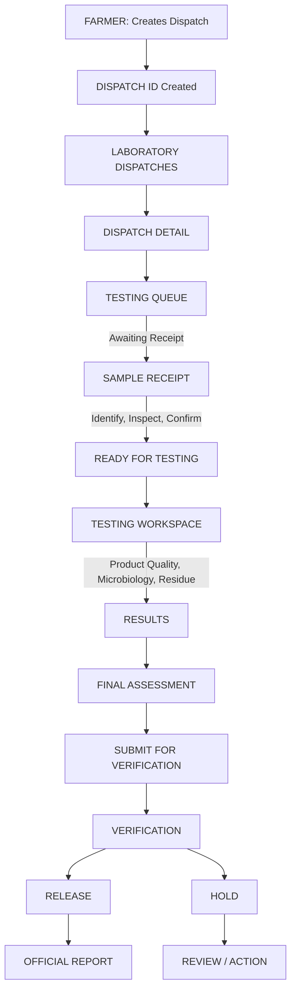

# PashuPramaan Laboratory Module: Data Flow & Architecture

The easiest way to understand the PashuPramaan Laboratory module is as one continuous workflow where the `Dispatch ID` (e.g., `MLK-2026-00124`) acts as the parent traceability record.

## Overall System Flow

---

## 1. Dispatches Tab

The Dispatches page is the directory of all livestock-product dispatches coming into the laboratory workflow. 

### Data Display
- **Source Table**: `lab_samples` joined with `farmer_dispatches` (via `dispatchId`)
- **Query**: `SELECT * FROM lab_samples`
- **Data Displayed**: 
  - `dispatchId` (e.g., MLK-2026-00124)
  - `sourceName` (e.g., Shree Krishna Dairy)
  - `product` & `productSub` (e.g., Raw Milk)
  - `animalId` (e.g., MP-104)
  - `sampleId` (e.g., LAB-MLK-00981)
- **Concept**: This page answers "What dispatches exist?" The system can state that a withdrawal period is completed, but analytical residue testing is still required.

---

## 2. Testing Queue Tab

This page answers "Which samples do I need to process next?" It is divided into two operational states.

### 2A. Awaiting Receipt
Samples that have been dispatched by the farmer but NOT physically received by the lab.

- **Data Source**: `lab_samples` where `stage = 'AWAITING_RECEIPT'`
- **Data Displayed**: Logistics-focused data (Dispatch ID, Sample ID, Expected Arrival, Priority, Reason). It explicitly does NOT show pending lab tests to keep the UI clean.
- **Action**: `Receive Sample →`
- **DB Update (Sample Receipt Flow)**: 
  - The technician confirms Identity, Inspects (Condition, Temp, Container), and Confirms.
  - **Mutation**: Submits to `/api/lab/dispatches/{dispatchId}/receive`
  - **DB Write**: Updates `lab_samples` table → `stage = 'RECEIVED'`, sets `receivedOn = datetime.utcnow()`.
  - The sample instantly moves to the **Ready for Testing** tab.

### 2B. Ready for Testing (Tests Active)
Samples physically received and ready for lab analysis.

- **Data Source**: `lab_samples` where `stage = 'RECEIVED'`
- **Data Displayed**: Testing-focused data (Sample ID, Required Tests list, statuses of tests like "In Progress" or "Pending").
- **Action**: `Start Testing →` (Navigates to Testing Workspace)

---

## 3. Results Tab & Testing Workspace

The workspace where the technician enters actual analytical findings. 

### Data Flow & Execution
- **Data Source**: `lab_tests` and `lab_samples`
- **Testing Process**: 
  - The UI guides the technician through tests (e.g., Product Quality, Microbiological Safety, Antimicrobial Residue).
  - Test 01 completes → Test 02 opens.
- **Action**: `Confirm & Complete →` (After reviewing test inputs)
- **DB Update (Finalizing Results)**:
  - **Mutation**: Submits test values (e.g., MRL value, unit) to `/api/lab/workspace/{sampleId}/tests`
  - **DB Writes**: 
    1. Creates a new record in `lab_reports` with the `refNo`, `verifiedBy`, measured values (`mrlMeasured`, `mrlLimit`), and `outcome`.
    2. Updates `lab_samples` table → `stage = 'VERIFIED'`.
    3. Updates `farmer_dispatches` table → Sets `status = 'CLEARED'` (or `BLOCKED` if MRL is exceeded) and logs `mrlMeasuredPpm`.
  - The sample disappears from the Testing Queue (as it is now VERIFIED).

---

## 4. Final Assessment & Reports Tab

This page combines Traceability, Withdrawal Verification, and Laboratory Results into an official outcome.

### Data Flow
- **Data Source**: `lab_reports`, `lab_assessments`, `farmer_dispatches`
- **Verification Step**: 
  - The technician submits the assessment, moving it to `AWAITING VERIFICATION`. 
  - Authorized personnel verify the assessment, resulting in a final disposition: **RELEASED** (Cleared for Dispatch) or **ON HOLD** (Requires veterinary/regulatory review).
- **Official Report**: 
  - Once CLEARED, the `lab_reports` record acts as the definitive official document.
  - **Farmer Sync**: The Farmer-side dashboard queries the updated `farmer_dispatches` record. Since the status is now `CLEARED`, it renders a verifiable QR Code and displays the measured PPM values natively on the farmer's Dispatch Details modal.

---

### Database Schema Map Reference
- **`farmer_dispatches`**: Creates the origin payload and receives the final synced lab verdict (status, PPM).
- **`lab_samples`**: Tracks the operational pipeline (`AWAITING_RECEIPT` → `RECEIVED` → `VERIFIED`).
- **`lab_tests`**: Individual testing blocks applied to a sample.
- **`lab_reports`**: The final aggregated analytical record.
- **`lab_assessments`**: Granular criteria checks linked to a report.
